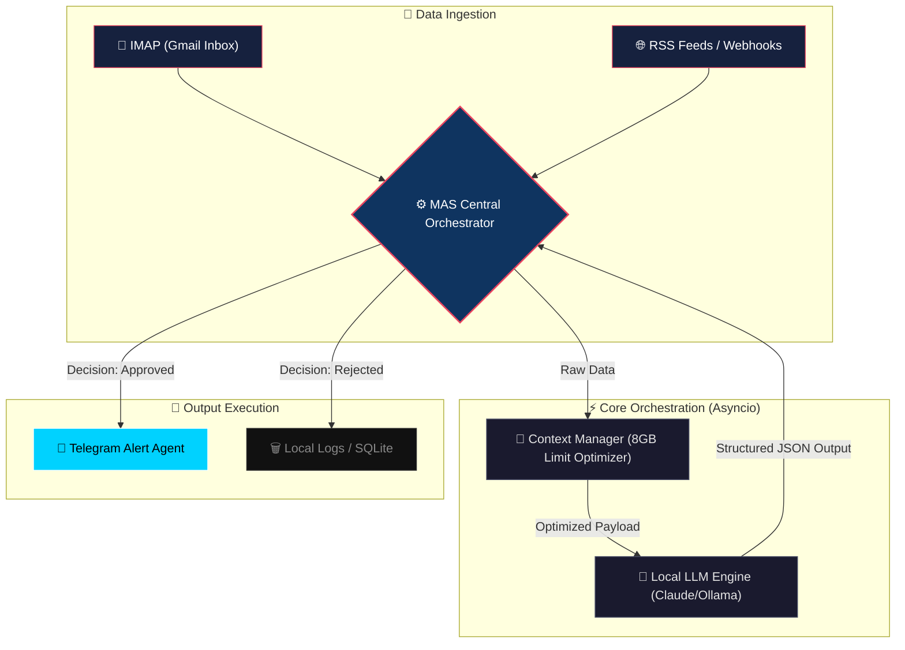

# 🧠 Local MAS (Multi-Agent System) Orchestrator

> **Status:** Active prototyping & internal tooling.
> **Philosophy:** *We are past the chatbot days. This is actual local AI orchestration.*

## 🚀 Overview
An asynchronous Multi-Agent System (MAS) designed to run perfectly on deeply constrained hardware (8GB RAM). 

Most AI implementations fail because they rely on massive cloud infrastructure and single-prompt magic. This project solves that by breaking down complex developer workflows into modular, dedicated local agents that run sequentially or asynchronously, managed by a central orchestrator.

### 📊 System Architecture Flow

🏗 System Architecture
The Brain (Orchestrator): mas_orchestrator.py - Manages agent lifecycle, task assignment, and context window limits.
Hardware First: Built to bypass the memory limits of commercial systems. Context is passed strictly via minimal JSON payloads, never dumping entire codebases.
Asynchronous I/O: Built natively on asyncio to handle multiple LLM API streams without freezing the main event loop.
💼 Why this matters (Business Outcome)
This is the "glue" between unstructured AI models and actual business systems. By orchestrating distinct agents (e.g., a Researcher, a Coder, a Reviewer) locally, we eliminate hallucination loops and ship production-ready automations faster than traditional software engineering cycles.

🛠 Tech Stack
Python 3.11+
Asyncio / Aiohttp
Local AI Context Management
